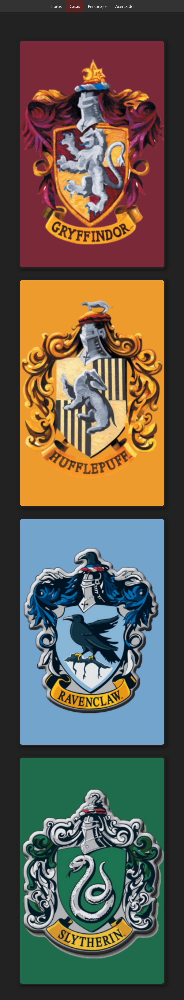
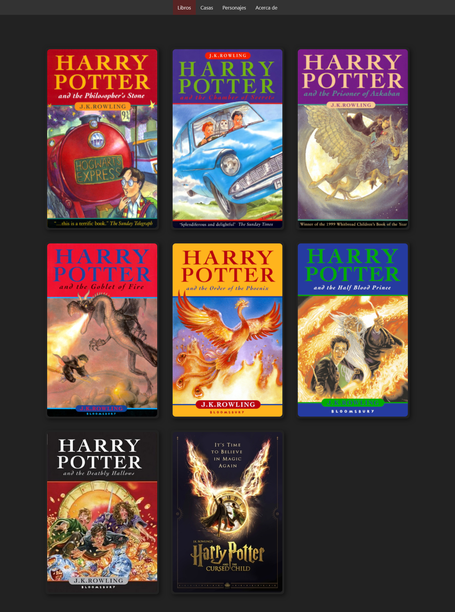

Este sitio es un proyecto de programación web utilizando tecnologías de: HTML4, CSS y JavaScript (vanilla). El sitio consume la API REST gratuita de PotterAPI para cargar dinámicamente la información, a excepción de los logos de las 4 casas de Hogwarts, que fueron diseñados por el autor del sitio.
Siéntete libre de emplear el código del repositorio, ya sea clonando o haciendo fork del proyecto, el cual está disponible en mi GitHub.

# Deploy
> https://luissubiabre.github.io/HarryPotter/
# Screenshot

## Mobile Screenshot
> 
## Desktop Screenshot
> 
